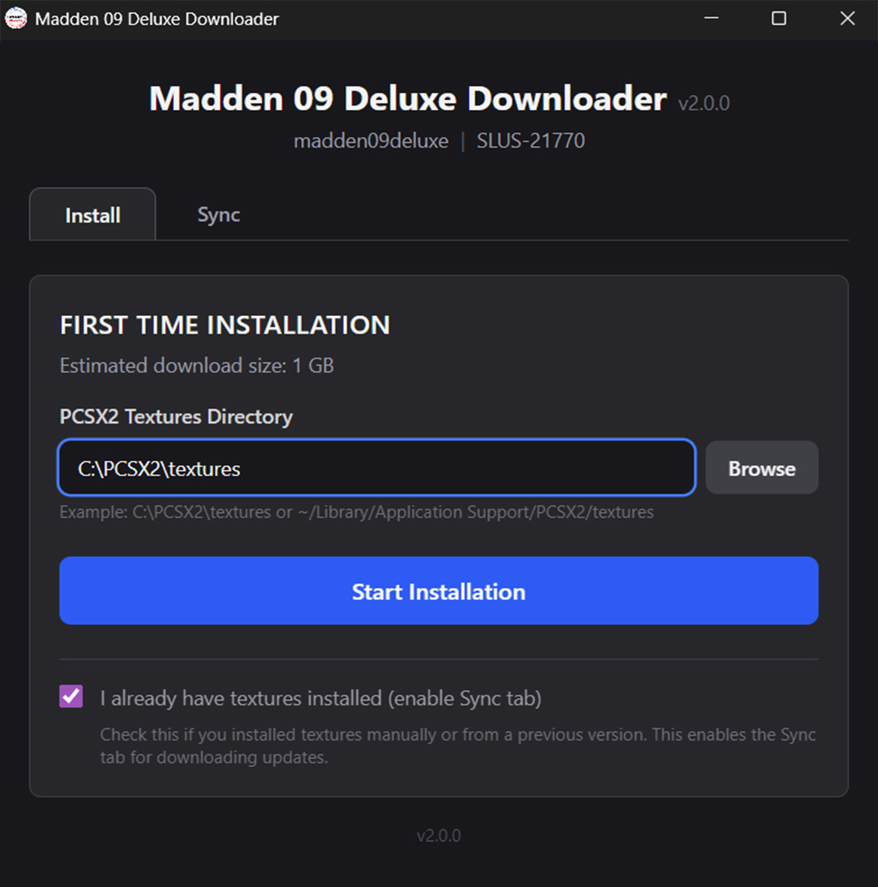
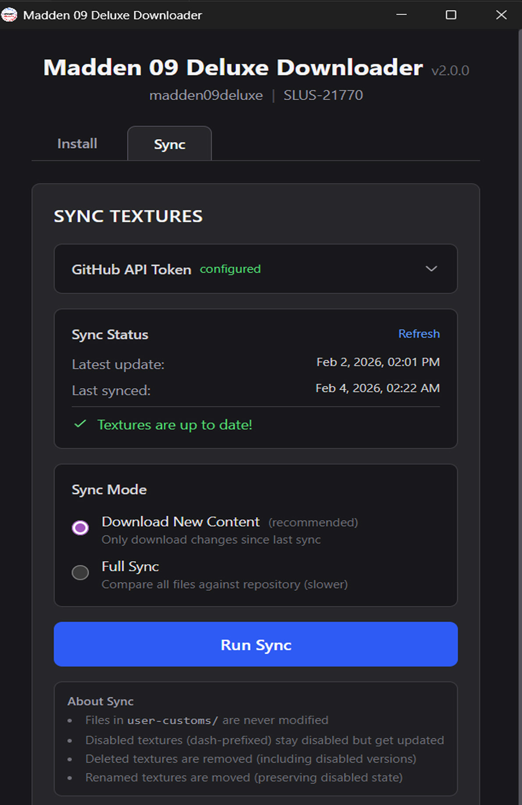
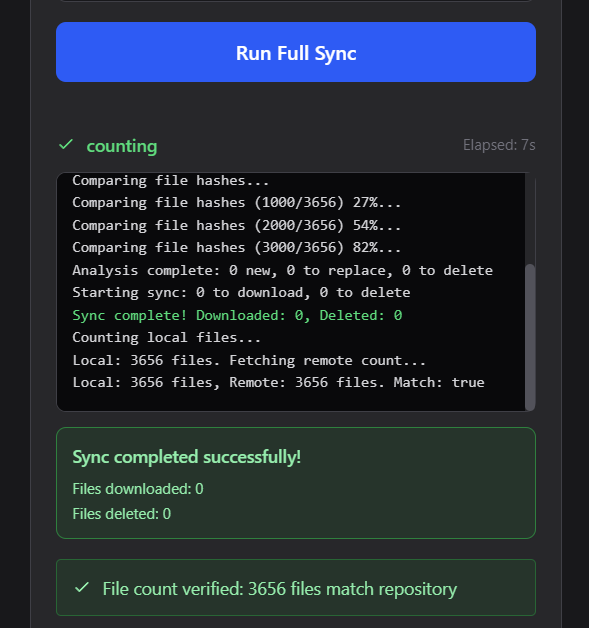
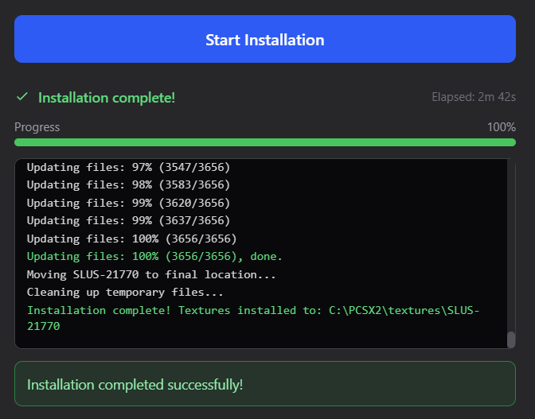
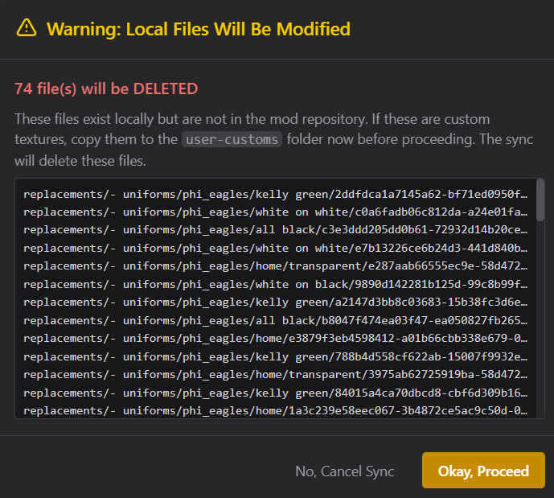

# Madden Deluxe Texture Downloader

This is a tool to download the Madden Deluxe texture packs, built with Tauri (Rust + React).

One codebase builds every loader. Each game is a folder under [`games/`](games/) holding
the only strings that differ; `GAME` picks it at build time, so no file is ever edited to
switch games and all of them can be built at once.

| Loader | Texture repo | PS2 folder |
| ------------- | ------------- | ------------- |
| Madden 04 Deluxe | [madden04deluxe](https://github.com/maddendeluxe/madden04deluxe) | `SLUS-20752` |
| Madden 05 Deluxe | [madden05deluxe](https://github.com/maddendeluxe/madden05deluxe) | `SLUS-21000` |
| Madden 09 Deluxe | [madden09deluxe](https://github.com/maddendeluxe/madden09deluxe) | `SLUS-21770` |
| Madden 12 Deluxe | [madden12deluxe](https://github.com/maddendeluxe/madden12deluxe) | `SLUS-21946` |

Releases: [maddendeluxe-textures-downloader-v2](https://github.com/maddendeluxe/maddendeluxe-textures-downloader-v2/releases/tag/release)

## Table of Contents
- [Features](#features)
  - [Mod Installer](#introduction--installer)
  - [Mod Updater](#introduction--updater)
  - [Post-Sync Verification](#introduction--verification)
- [Handling User-Custom Textures](#custom-textures)
- [Installation](#installation)
  - [Windows](#installation--windows)
  - [macOS](#installation--macos)
  - [Linux](#installation--linux)
- [Uninstalling](#uninstalling)
- [Using the App](#usage)
  - [First Time Setup](#usage--setup)
  - [Updating and Syncing](#usage--sync)
- [Uninstalling](#uninstalling)
- [Building the Linux Bundles Yourself](#linux-build)
- [License](#license)

---

## Features <a name="features">

For users of a PS2 mod that requires a massive folder of replacement textures, downloading multi-GB zip files and keeping things updated can be tedious. This app provides:

### Mod Installer <a name="introduction--installer">

The **First Time Setup** uses Git sparse checkout to efficiently download only the texture files you need (not the entire repository). This is faster and more reliable than downloading a massive zip file, which can fail or become corrupted. The installer automatically places textures in the correct location within your emulator's textures folder.



### Mod Updater <a name="introduction--updater">

The **Sync** feature keeps your textures up-to-date with two modes:

- **Download New Content** (Incremental Sync): Quickly grabs only the changes since your last sync. Uses the GitHub Compare API to identify new, modified, renamed, and deleted files.

- **Full Sync**: Compares every local file against the repository using SHA hash verification. Use this occasionally or when experiencing texture issues.

Both modes will:
- Download new and modified files
- Rename/move files that were reorganized
- Delete files that were removed from the project
- Preserve your disabled textures (dash-prefixed files)
- Never touch your `user-customs` folder



### Post-Sync Verification <a name="introduction--verification">

After every sync, the app performs a quick file count verification to ensure your local installation matches the repository. If a mismatch is detected, you'll be prompted to run a Full Sync to resolve discrepancies.



---

## Handling User-Custom Textures <a name="custom-textures">

This app is designed with texture customization in mind:

### The `user-customs` Folder

Put all of your custom textures in the `user-customs` folder (inside the `replacements` folder). **The app will never modify, update, or delete anything in this folder.** This is the safe place for your personal textures and DLC content.

### Disabling Default Textures

When using custom textures, you need to disable the mod's default texture so yours takes precedence. To do this:

1. **Keep the default texture in place** (don't delete it)
2. **Prepend the filename with a dash** (e.g., rename `3a30272f374c5d47.png` to `-3a30272f374c5d47.png`)

The dash prefix "disables" the texture - the emulator ignores it, but the app still recognizes it. When the mod team updates that texture, **your disabled version will be updated too**, keeping you in sync without breaking your custom texture.

**Important**: If you delete the default texture instead of disabling it, the sync will re-download it and potentially cause conflicts with your custom texture.

---

## Installation <a name="installation"></a>

### Windows <a name="installation--windows"></a>

1. Download `windows-portable.zip` from the [latest release](../../releases/latest)
2. Extract the zip file somewhere on your computer (e.g., `C:\Apps\` or your Desktop)
3. Open the extracted folder and run the `.exe` file to launch the app

**Note**: The app includes a bundled copy of Git (MinGit), so you don't need to install Git separately.

#### Updating the App (Windows)

1. Download the new `windows-portable.zip` from the latest release
2. Extract and replace the existing app folder
3. Your settings (including GitHub API token) are stored separately and will be preserved

### macOS <a name="installation--macos"></a>

1. Download the Mac installer file from the [latest release](../../releases/latest)
2. Open the DMG and drag the app to your Applications folder
3. On first launch, right-click the app and select "Open" to bypass Gatekeeper. In some cases you might need to go to Setting > Privacy & Security, scroll down, and allow the app to run in the Security settings section.

#### Updating the App (macOS)

Simply download the new `.dmg` and drag the app to your Applications folder, replacing the old version. Your settings are stored in your user Library folder and will be preserved.

### Linux <a name="installation--linux"></a>

The app uses your system's Git, so install it first if you haven't (`sudo apt install git`, `sudo dnf install git`, or `sudo pacman -S git`).

**AppImage** (any distro):

1. Download the `.AppImage` from the [latest release](../../releases/latest)
2. Make it executable and run it:
   ```bash
   chmod +x Madden*.AppImage
   ./Madden*.AppImage
   ```
   You can also right-click the file, open Properties, tick "Allow executing as program" and double-click it.

AppImages need `libfuse2`, which Ubuntu 22.04 and newer and Debian 12 no longer install by default. If you get `dlopen(): error loading libfuse.so.2`, run `sudo apt install libfuse2` (Ubuntu 24.04: `sudo apt install libfuse2t64`) or start the app with `./Madden*.AppImage --appimage-extract-and-run`. Fedora and SteamOS already have it.

**Debian / Ubuntu**: download the `.deb` and run `sudo apt install ./madden*.deb`.
**Fedora**: download the `.rpm` and run `sudo dnf install ./madden*.rpm`.

Live download progress uses the `script` command from `util-linux`, which is present on virtually every distro. Without it the install still works, just without percentages.

If the window opens blank, your WebKitGTK build is fighting the GPU driver. The app already sets `WEBKIT_DISABLE_DMABUF_RENDERER=1` for you; if it still happens try `WEBKIT_DISABLE_COMPOSITING_MODE=1 ./Madden*.AppImage`.

#### Steam Deck

Switch to Desktop Mode, download the `.AppImage` to your home folder, then follow the AppImage steps above (SteamOS ships both `git` and `libfuse2`, so nothing needs installing). When the app asks for your PCSX2 textures directory, use the one that matches how you installed PCSX2:

| PCSX2 install | Textures directory |
|---|---|
| EmuDeck (internal storage) | `/home/deck/Emulation/storage/pcsx2/textures` |
| EmuDeck (SD card) | `/run/media/mmcblk0p1/Emulation/storage/pcsx2/textures` |
| PCSX2 Flatpak from Discover | `/home/deck/.var/app/net.pcsx2.PCSX2/config/PCSX2/textures` |
| PCSX2 AppImage | `/home/deck/.config/PCSX2/textures` |

PCSX2 shows the exact folder under Settings > Graphics > Texture Replacements. Type or paste the path into the box if the Browse dialog is awkward with the trackpad.

#### Updating the App (Linux)

Download the new `.AppImage`/`.deb`/`.rpm` and replace or reinstall. Your settings live in `~/.local/share/com.madden09deluxe.textures-downloader` and will be preserved.

#### No-app alternative: the shell script

If you'd rather not run a GUI at all, `src/download_textures.sh` does the first-time install from a terminal on Linux or macOS. Copy it into your PCSX2 textures folder and run `./download_textures.sh`, or pass the folder as an argument. Updates afterwards still need the app's Sync tab.

---

## Using the App <a name="usage"></a>

### First Time Textures Installation <a name="usage--setup">

1. Select the **Install** tab
2. Browse to your PCSX2 textures folder. You can find the exact path in PCSX2 (or AetherSX2) at Settings > Graphics > Texture Replacements.
3. Click **Start Installation**
4. Wait for the download to complete (this may take a while for large texture packs)

The installer uses Git sparse checkout to efficiently download only the texture files. Progress is displayed in real-time. 

**Requirements for Mac Users Only**: Git must be installed. If you don't have it, install Xcode Command Line Tools by running in Terminal:
```bash
xcode-select --install
```



### Updating and Syncing <a name="usage--sync">

1. Select the **Sync** tab
2. Ensure your GitHub API Token is configured (instructions below)
3. Choose your sync mode:
   - **Download New Content**: Fast, only downloads changes since last sync (recommended for regular use)
   - **Full Sync**: Compares all files, slower but thorough (use occasionally or when troubleshooting)
4. Click **Run Sync**


**Warning Dialogs**: When running a Full Sync, if files will be replaced or deleted, you'll see a warning dialog listing the affected files. This gives you a chance to back up any custom textures to the `user-customs` folder before proceeding.



#### GitHub API Token (Required for Sync)

A GitHub Personal Access Token is required for the sync features. Here's how to get one:

1. Create a free Github account, if needed, and generate a "Fine-Grained" API token. Go to Settings > Developer Settings > Personal Access Tokens > Fine-Grained Tokens > [Generate New Token](https://github.com/settings/personal-access-tokens/new?name=Textures+Downloader&description=Token+for+syncing+textures&expires_in=365).
2. Give it a name (e.g., "PS2 Mod Textures Downloader")
3. Set expiration to 1 year (maximum)
4. **No permissions are needed** - leave everything unchecked
5. Click "Generate Token" and copy it
6. Paste the token into the app's GitHub API Token field and click Save.


---

## Uninstalling <a name="uninstalling"></a>

#### Uninstalling (Windows)

1. Delete the app folder you extracted
2. To remove saved settings, delete `%LOCALAPPDATA%\com.madden09deluxe.textures-downloader` (paste this path
  in File Explorer's address bar)

#### Uninstalling (MacOS)

1. Delete the app from Applications
2. Delete `~/Library/Application Support/com.madden09deluxe.textures-downloader`

#### Uninstalling (Linux)

1. Delete the `.AppImage`, or `sudo apt remove madden-09-deluxe-downloader` / `sudo dnf remove madden-09-deluxe-downloader`
   (the package is named after the loader you installed, e.g. `madden-12-deluxe-downloader`)
2. Delete `~/.local/share/com.madden09deluxe.textures-downloader`

---

## Building the Linux Bundles Yourself <a name="linux-build"></a>

CI builds the AppImage, `.deb` and `.rpm` for **every game** on every push, but you can build them on any Linux box with rootless Podman (or Docker) without installing Rust or WebKitGTK on the host:

```bash
tools/linux-build/build.sh                       # every loader in games/
tools/linux-build/build.sh --game madden12       # just one
tools/linux-build/build.sh --game all --bundles "appimage"
tools/linux-build/build.sh --self-test           # container recipe, manifests, and CI coverage
```

Each game lands in its own `build-output/<game>/` with the bundles, a rendered
`download_textures.sh` and a `SHA256SUMS`. Switching games edits nothing: `GAME`
selects the constants that `src-tauri/build.rs` and `vite.config.ts` read from
[`games/<id>/game.json`](games/), and `--config games/<id>/tauri.conf.json` gives the
bundle its name and identifier. See [`games/README.md`](games/README.md) to add a loader.

The container is an Ubuntu 22.04 image with the same packages as the CI job, so a local build matches what the release workflow produces.

**If you build the AppImage by hand** with `npx tauri build`, run the post-processing step
afterwards:

```bash
tools/linux-build/strip-bundled-wayland.sh src-tauri/target/release/bundle/appimage/*.AppImage
```

The bundler copies the build machine's `libwayland-*` into the AppImage. On a Wayland
desktop those clash with the user's own Mesa driver, EGL refuses the display and the window
opens but never paints. `build.sh` and CI do this for you; a hand-rolled `tauri build` does
not. `--check` on the same script fails if any are still bundled.

---

## License <a name="license">

PS2 Textures Downloader © 2024-2026 by JD6-37 is licensed under [CC BY-NC 4.0](http://creativecommons.org/licenses/by-nc/4.0/)

This license requires that reusers give credit to the creator. It allows reusers to distribute, remix, adapt, and build upon the material in any medium or format, for noncommercial purposes only.
